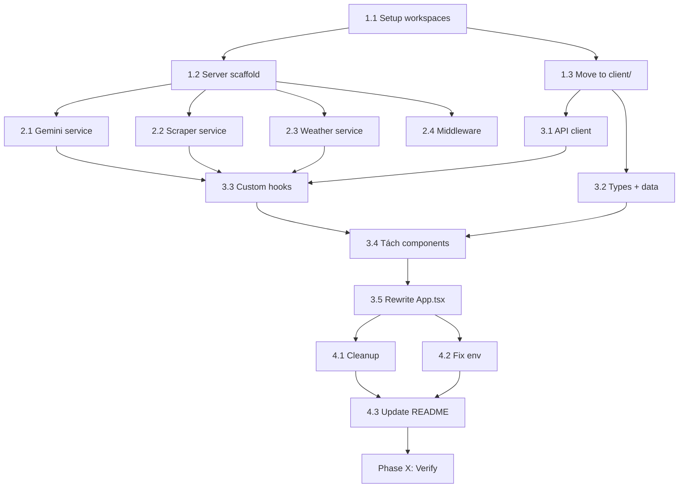

# PLAN: Client-Server Restructure — Widget Date

> 🤖 **Agents:** `@project-planner` → `@backend-specialist` → `@frontend-specialist` → `@security-auditor`

**Ngày tạo:** 2026-04-20
**Trạng thái:** ⏳ Chờ duyệt

---

## 1. Overview

### Vấn đề hiện tại
- API Keys (Gemini, OpenWeather) bị bake vào client JS bundle qua prefix `VITE_` → ai cũng đọc được trên DevTools
- `App.tsx` = 1306 dòng God Component chứa MỌI THỨ
- `data.tsx` = 973 dòng mix interfaces + JSX + hardcoded JSON
- `geminiService.ts` gọi API trực tiếp từ frontend
- `allorigins.win` = proxy bên thứ 3 không tin cậy
- `data-service/` = stale crawlers không liên kết với app

### Giải pháp
Chuyển sang kiến trúc **Client-Server Monorepo**:
- **`server/`** (Express + TS): Proxy tất cả external API calls, giấu key phía server
- **`client/`** (React + Vite + Tailwind): Chỉ gọi API nội bộ `/api/*`, không chứa secret

### Project Type
**WEB** (React frontend + Node.js backend)

---

## 2. Success Criteria

| # | Tiêu chí | Đo lường |
|---|----------|----------|
| 1 | Không còn API key nào trong client bundle | `grep -r "AIza" client/` returns 0 |
| 2 | Server proxy hoạt động đúng 4 endpoints | `curl localhost:3001/api/health` returns OK |
| 3 | `App.tsx` < 150 dòng (chỉ routing + layout) | `wc -l client/src/App.tsx` < 150 |
| 4 | Mỗi component < 200 dòng | Kiểm tra từng file |
| 5 | `npm run build` (client) thành công | Exit code 0, no errors |
| 6 | `npm run dev` (server) start không lỗi | Port 3001 listen OK |
| 7 | App hoạt động end-to-end giống y bản cũ | Manual test tất cả features |

---

## 3. Tech Stack

| Layer | Tech | Rationale |
|-------|------|-----------|
| **Frontend** | React 19 + Vite 6 + Tailwind v4 | Giữ nguyên, đã ổn |
| **Backend** | Express 4 + TypeScript | Đã có trong `package.json` |
| **Runtime** | `tsx` (dev) / `node` (prod) | `tsx` đã có, hỗ trợ TS trực tiếp |
| **Monorepo** | npm workspaces | Nhẹ, không cần thêm tool ngoài |
| **Env** | `dotenv` (server only) | Đã có, key chỉ ở server |

---

## 4. File Structure (Target)

```
Widget_Date/
├── package.json                  # [MODIFY] Root workspace config
├── .env                          # [MODIFY] Server-only (KHÔNG còn VITE_ prefix)
├── .env.example                  # [MODIFY] Cập nhật template
├── .gitignore                    # [MODIFY] Thêm dist/, *.sqlite
├── README.md                     # [MODIFY] Cập nhật hướng dẫn
│
├── server/                       # [NEW] ================================
│   ├── package.json              #   Express + @google/genai + dotenv
│   ├── tsconfig.json             #   Target: ES2022, module: NodeNext
│   └── src/
│       ├── index.ts              #   Entry: Express app, CORS, routes
│       ├── config/
│       │   └── env.ts            #   Validate env vars on startup
│       ├── routes/
│       │   ├── gemini.ts         #   POST /api/nearby-places
│       │   │                     #   POST /api/combos
│       │   │                     #   POST /api/chat
│       │   ├── scraper.ts        #   GET  /api/place-image?url=...
│       │   └── weather.ts        #   GET  /api/weather?city=...
│       ├── services/
│       │   ├── geminiService.ts  #   Logic từ services/geminiService.ts cũ
│       │   ├── scraperService.ts #   Logic allorigins thay = server-side fetch
│       │   └── weatherService.ts #   Fetch OpenWeather
│       └── middleware/
│           ├── errorHandler.ts   #   Global error handler
│           └── rateLimit.ts      #   Optional: rate limiting
│
├── client/                       # [MODIFY] ============================
│   ├── package.json              #   React deps (KHÔNG có @google/genai)
│   ├── tsconfig.json             #   Giữ cấu hình hiện tại
│   ├── vite.config.ts            #   [MODIFY] Xóa define block, thêm proxy
│   ├── index.html                #   [MOVE] Từ root
│   └── src/
│       ├── main.tsx              #   [MOVE] Giữ nguyên
│       ├── index.css             #   [MOVE] Giữ nguyên
│       ├── App.tsx               #   [REWRITE] ~100 dòng: layout + routing
│       │
│       ├── types/
│       │   └── index.ts          #   [NEW] Tất cả interfaces tập trung
│       │
│       ├── data/
│       │   ├── locations.json    #   [NEW] REAL_LOCATIONS data (JSON thuần)
│       │   ├── constants.ts      #   [NEW] SAMPLE_COMBOS, MILESTONES, BADGES, etc.
│       │   ├── trends.ts         #   [NEW] TRENDS array
│       │   └── movies.ts         #   [NEW] MOVIES array
│       │
│       ├── services/
│       │   └── api.ts            #   [NEW] Fetch wrapper → /api/* endpoints
│       │
│       ├── hooks/
│       │   ├── useWeather.ts     #   [NEW] Fetch weather từ server
│       │   ├── useReward.ts      #   [NEW] localStorage gamification logic
│       │   ├── useChat.ts        #   [NEW] Chat state + API calls
│       │   ├── useGeolocation.ts #   [NEW] Navigator.geolocation logic
│       │   └── useToast.ts       #   [NEW] Toast state management
│       │
│       ├── components/
│       │   ├── layout/
│       │   │   ├── Header.tsx    #   [NEW] Sticky header
│       │   │   └── BottomNav.tsx #   [NEW] Tab navigation bar
│       │   │
│       │   ├── home/
│       │   │   ├── WeatherBanner.tsx   #   [NEW] Banner thời tiết
│       │   │   ├── DateWarning.tsx     #   [NEW] Cảnh báo chưa hẹn hò
│       │   │   ├── DateForm.tsx        #   [NEW] Form lên lịch (budget, companion...)
│       │   │   └── ComboList.tsx       #   [NEW] Danh sách combo + activities
│       │   │
│       │   ├── explore/
│       │   │   ├── ExploreView.tsx     #   [NEW] Tab container (map/swipe/movies/trends)
│       │   │   ├── MapView.tsx         #   [NEW] Bản đồ + danh sách địa điểm
│       │   │   ├── SwipeView.tsx       #   [NEW] Tinder-like cards container
│       │   │   ├── SwipeCard.tsx       #   [MOVE] Từ App.tsx (lines 14-95)
│       │   │   ├── MovieList.tsx       #   [NEW] Danh sách phim
│       │   │   └── TrendList.tsx       #   [NEW] Trending items
│       │   │
│       │   ├── wallet/
│       │   │   └── DateMilesView.tsx   #   [NEW] Gamification dashboard
│       │   │
│       │   ├── modals/
│       │   │   ├── PaymentModal.tsx    #   [NEW] Thanh toán combo
│       │   │   ├── RideModal.tsx       #   [NEW] Gọi xe Grab/Be/Xanh SM
│       │   │   └── ImageViewer.tsx     #   [NEW] Xem ảnh thực tế
│       │   │
│       │   ├── chat/
│       │   │   └── ChatPanel.tsx       #   [NEW] Full-screen AI chat
│       │   │
│       │   └── ui/
│       │       ├── Toast.tsx           #   [MOVE] Giữ nguyên
│       │       └── AIMonitor.tsx       #   [MOVE] Từ App.tsx (lines 101-155)
│       │
│       └── lib/
│           └── utils.ts               #   [MOVE] Giữ nguyên + thêm formatVND
│
├── _archive/                     # [NEW] ================================
│   └── data-service/             #   [MOVE] Archive nguyên folder cũ
│
└── [DELETE]
    ├── src/                      #   Xóa sau khi moved sang client/src/
    ├── data-service/             #   Moved sang _archive/
    └── dist/                     #   Build output, xóa khỏi git
```

---

## 5. Component Decomposition Map

> Mapping từ `App.tsx` hiện tại → components mới

| App.tsx Lines | Logic | → Target File | Ước tính |
|---------------|-------|---------------|----------|
| 1-9 | Imports | Phân bổ vào từng file | - |
| 10-11 | Type definitions | `types/index.ts` | 5 dòng |
| 14-95 | `SwipeCard` component | `components/explore/SwipeCard.tsx` | ~80 dòng |
| 97-99 | `formatVND` | `lib/utils.ts` | 3 dòng |
| 101-155 | `AIMonitor` component | `components/ui/AIMonitor.tsx` | ~55 dòng |
| 157-270 | State declarations + hooks | Phân bổ vào custom hooks | - |
| 277-290 | Weather fetch | `hooks/useWeather.ts` | ~30 dòng |
| 292-361 | Geolocation + sort | `hooks/useGeolocation.ts` | ~60 dòng |
| 363-378 | Chat logic | `hooks/useChat.ts` | ~40 dòng |
| 380-407 | Generate combos | Inline trong `DateForm.tsx` | ~30 dòng |
| 409 | `showToast` | `hooks/useToast.ts` | ~15 dòng |
| 411-454 | Payment + Ride handlers | Tương ứng modal components | ~40 dòng |
| 456-656 | `renderHome()` | `components/home/*` (4 files) | ~200 dòng |
| 658-878 | `renderExplore()` | `components/explore/*` (5 files) | ~220 dòng |
| 881-975 | `renderDateMiles()` | `components/wallet/DateMilesView.tsx` | ~95 dòng |
| 977-1006 | `renderHistory()` | Gộp vào `DateMilesView.tsx` | ~30 dòng |
| 1008-1052 | Main layout + nav | `App.tsx` + `layout/` | ~50 dòng |
| 1054-1098 | PaymentModal | `components/modals/PaymentModal.tsx` | ~45 dòng |
| 1102-1131 | RideModal | `components/modals/RideModal.tsx` | ~30 dòng |
| 1133-1221 | ImageViewer | `components/modals/ImageViewer.tsx` | ~90 dòng |
| 1223-1300 | Chat UI | `components/chat/ChatPanel.tsx` | ~80 dòng |
| 1301-1305 | AIMonitor + Toast | Đã tách | - |

---

## 6. Server API Design

### Endpoints

| Method | Path | Request Body | Response | Source |
|--------|------|-------------|----------|--------|
| `GET` | `/api/health` | - | `{ status: "ok" }` | Mới |
| `POST` | `/api/nearby-places` | `{ location: string }` | `ExploreResult` | `fetchNearbyPlaces()` |
| `POST` | `/api/combos` | `ComboParams` | `Combo[]` | `generateCombos()` |
| `POST` | `/api/chat` | `{ history, message }` | `{ reply: string }` | `chatWithAI()` |
| `GET` | `/api/place-image` | `?url=<maps_url>` | `{ imageUrl: string \| null }` | `scrapeGoogleMapsImage()` |
| `GET` | `/api/weather` | `?city=Hanoi` | `WeatherData` | OpenWeather fetch |

### Security

| Concern | Solution |
|---------|----------|
| API Key protection | Key chỉ nằm trong `.env` server, KHÔNG gửi xuống client |
| CORS | `cors({ origin: 'http://localhost:5173' })` |
| Rate limiting | express-rate-limit trên `/api/chat` (prevent abuse) |
| Input validation | Validate body params trước khi gọi Gemini |
| Error handling | Global error middleware, KHÔNG leak stack traces |

---

## 7. Task Breakdown

### Phase 1: Foundation — Monorepo + Server Scaffold
**Agent:** `@backend-specialist` | **Skill:** `nodejs-best-practices`, `api-patterns`

#### Task 1.1: Setup npm workspaces
- **INPUT:** Current `package.json` at root
- **OUTPUT:** Root `package.json` with workspaces config, `client/package.json`, `server/package.json`
- **VERIFY:** `npm install` from root succeeds, both workspaces recognized
- **Chi tiết:**
  - Root `package.json`: `"workspaces": ["client", "server"]`
  - Move React deps → `client/package.json`
  - Move `express`, `@google/genai`, `dotenv` → `server/package.json`
  - `client/` gets its own `vite.config.ts` + `tsconfig.json`

#### Task 1.2: Server scaffold
- **INPUT:** Blank `server/` directory
- **OUTPUT:** Express server with health endpoint
- **VERIFY:** `npm run dev -w server` → `curl localhost:3001/api/health` returns `{ "status": "ok" }`
- **Chi tiết:**
  - `server/src/index.ts`: Express app, CORS, JSON body parser
  - `server/src/config/env.ts`: Load `.env`, validate `GEMINI_API_KEY` + `OPENWEATHER_API_KEY`
  - `server/tsconfig.json`: `module: "NodeNext"`, `target: "ES2022"`, `outDir: "./dist"`
  - `server/package.json`: `"dev": "tsx watch src/index.ts"`, `"start": "node dist/index.js"`

#### Task 1.3: Move files to `client/`
- **INPUT:** Current `src/`, `index.html`, `vite.config.ts`, `tsconfig.json`
- **OUTPUT:** All moved under `client/`
- **VERIFY:** `npm run dev -w client` starts Vite on port 5173
- **Chi tiết:**
  - Dời `src/` → `client/src/`
  - Dời `index.html` → `client/index.html`
  - Dời `vite.config.ts` → `client/vite.config.ts`
  - Dời `tsconfig.json` → `client/tsconfig.json`
  - Xóa block `define` redundant trong `vite.config.ts`
  - Cấu hình Vite proxy: `/api` → `http://localhost:3001`

---

### Phase 2: Backend — Migrate Service Logic
**Agent:** `@backend-specialist` | **Skill:** `api-patterns`, `nodejs-best-practices`
**Depends on:** Phase 1

#### Task 2.1: Gemini service migration
- **INPUT:** `client/src/services/geminiService.ts`
- **OUTPUT:** `server/src/services/geminiService.ts` + `server/src/routes/gemini.ts`
- **VERIFY:** `POST /api/combos` with test params returns 5 combos JSON
- **Chi tiết:**
  - Copy core logic: `getAIClient()`, `fetchNearbyPlaces()`, `generateCombos()`, `chatWithAI()`
  - Remove `import.meta.env` → use `process.env`
  - Remove AI logging (client-side concern)
  - Routes: validate body → call service → return JSON

#### Task 2.2: Scraper service
- **INPUT:** `scrapeGoogleMapsImage()` fn + `allorigins.win` logic
- **OUTPUT:** `server/src/services/scraperService.ts` + `server/src/routes/scraper.ts`
- **VERIFY:** `GET /api/place-image?url=<maps_url>` returns `{ imageUrl: "..." }`
- **Chi tiết:**
  - Server-side fetch trực tiếp (không cần allorigins proxy!)
  - Parse `og:image` meta tag giống logic cũ
  - Server-side cache bằng Map object (thay localStorage)

#### Task 2.3: Weather service
- **INPUT:** Weather fetch logic trong `App.tsx` (lines 277-290)
- **OUTPUT:** `server/src/services/weatherService.ts` + `server/src/routes/weather.ts`
- **VERIFY:** `GET /api/weather?city=Hanoi` returns OpenWeather JSON
- **Chi tiết:**
  - Giấu `OPENWEATHER_API_KEY` phía server
  - Optional: cache response 10 phút

#### Task 2.4: Error handler + rate limiter
- **INPUT:** Không có
- **OUTPUT:** `server/src/middleware/errorHandler.ts`, `server/src/middleware/rateLimit.ts`
- **VERIFY:** Bad request trả 400 JSON, server crash trả 500 JSON (không leak stack)
- **Chi tiết:**
  - Global try/catch wrapper
  - Rate limit `/api/chat` → 10 req/min per IP

---

### Phase 3: Frontend Restructure
**Agent:** `@frontend-specialist` | **Skill:** `react-best-practices`, `clean-code`
**Depends on:** Phase 2

#### Task 3.1: Tạo `services/api.ts` — Client API layer
- **INPUT:** 6 server endpoints
- **OUTPUT:** `client/src/services/api.ts` — typed fetch wrapper
- **VERIFY:** Import + sử dụng không TS errors
- **Chi tiết:**
  - `fetchNearbyPlaces(location)`, `generateCombos(params)`, `chatWithAI(history, msg)`
  - `fetchPlaceImage(url)`, `fetchWeather(city)`
  - Gõ `fetch('/api/...')`, Vite proxy handle routing

#### Task 3.2: Tách types + data files
- **INPUT:** `data.tsx` (973 dòng)
- **OUTPUT:** `types/index.ts`, `data/locations.json`, `data/constants.ts`, `data/trends.ts`, `data/movies.ts`
- **VERIFY:** Tất cả imports across codebase resolve, no TS errors
- **Chi tiết:**
  - Interfaces → `types/index.ts`
  - `REAL_LOCATIONS` (JSON) → `data/locations.json`
  - `SAMPLE_COMBOS`, `MILESTONES`, `BADGES`, `OUTFIT_STYLES`, `RENTAL_STYLES`, `THEME_TO_OUTFIT_STYLE` → `data/constants.ts`
  - `TRENDS` → `data/trends.ts`
  - `MOVIES` → `data/movies.ts`
  - Xóa JSX khỏi data files (SAMPLE_COMBOS icon: `<Heart />` → string emoji)

#### Task 3.3: Tạo custom hooks
- **INPUT:** Logic nằm rải rác trong `App.tsx`
- **OUTPUT:** 5 hook files trong `hooks/`
- **VERIFY:** Mỗi hook export đúng interface, import thành công
- **Chi tiết:**
  | Hook | Trích từ App.tsx | Chức năng |
  |------|-----------------|-----------|
  | `useWeather` | L277-290 | Fetch weather từ `/api/weather` |
  | `useReward` | L221-261 | localStorage gamification, `earnMiles()` |
  | `useChat` | L169-378 | Chat state, `sendMessage()` |
  | `useGeolocation` | L292-361 | Navigator.geolocation + sort logic |
  | `useToast` | L165+409 | Toast state management |

#### Task 3.4: Tách components từ App.tsx
- **INPUT:** `App.tsx` 1306 dòng
- **OUTPUT:** 16 component files (xem Component Decomposition Map)
- **VERIFY:** Mỗi file < 200 dòng, no TS errors
- **Chi tiết:**
  - **layout/**: `Header.tsx` (L1012-1020), `BottomNav.tsx` (L1031-1052)
  - **home/**: `WeatherBanner.tsx`, `DateWarning.tsx` (L497-511), `DateForm.tsx` (L513-569), `ComboList.tsx` (L572-654)
  - **explore/**: `ExploreView.tsx`, `MapView.tsx` (L675-757), `SwipeView.tsx` (L759-813), `SwipeCard.tsx` (L14-95), `MovieList.tsx` (L816-851), `TrendList.tsx` (L853-877)
  - **wallet/**: `DateMilesView.tsx` (L881-975 + L977-1006)
  - **modals/**: `PaymentModal.tsx` (L1054-1098), `RideModal.tsx` (L1102-1131), `ImageViewer.tsx` (L1133-1221)
  - **chat/**: `ChatPanel.tsx` (L1232-1300)
  - **ui/**: `AIMonitor.tsx` (L101-155)

#### Task 3.5: Rewrite App.tsx
- **INPUT:** Tất cả components + hooks đã tách
- **OUTPUT:** `App.tsx` < 100 dòng — chỉ import + routing + layout
- **VERIFY:** `App.tsx` < 150 dòng, app renders giống bản cũ
- **Chi tiết:**
  ```tsx
  // App.tsx — Clean version (~80 dòng)
  // - Import hooks + components
  // - Layout: Header + main + BottomNav
  // - AnimatePresence tab switching
  // - Render các modals + ChatFAB + AIMonitor
  ```

---

### Phase 4: Cleanup
**Agent:** `@security-auditor` | **Skill:** `vulnerability-scanner`
**Depends on:** Phase 3

#### Task 4.1: Xóa file/folder cũ
- **INPUT:** Cấu trúc cũ
- **OUTPUT:** Clean repo
- **VERIFY:** No orphan files, `git status` clean
- **Chi tiết:**
  - Move `data-service/` → `_archive/data-service/`
  - Xóa `dist/` khỏi git
  - Xóa `src/` cũ ở root (đã moved sang `client/src/`)
  - Xóa `client/src/services/geminiService.ts` (logic đã ở server)

#### Task 4.2: Fix `.env` + `.gitignore`
- **INPUT:** `.env` hiện tại có prefix `VITE_`
- **OUTPUT:** `.env` ở root (server reads) — không có `VITE_` prefix
- **VERIFY:** `grep VITE_ .env` returns 0, server đọc key OK
- **Chi tiết:**
  - `.env`: `GEMINI_API_KEY=...`, `OPENWEATHER_API_KEY=...`, `PORT=3001`
  - `.env.example`: Template tương ứng
  - `.gitignore`: Thêm `dist/`, `_archive/`, `*.sqlite`

#### Task 4.3: Update README.md
- **INPUT:** README cũ
- **OUTPUT:** README mới phản ánh monorepo structure
- **VERIFY:** Hướng dẫn chạy `npm install` + `npm run dev` hoạt động

---

### Phase X: Verification

#### Automated Checks

```powershell
# 1. Build check
npm run build -w client

# 2. Security scan — không còn key trong client
Select-String -Path "client\src\**\*" -Pattern "AIza" -Recurse
# Expected: 0 matches

# 3. File size check
(Get-Content client\src\App.tsx).Count
# Expected: < 150

# 4. Server health
npm run dev -w server
# In another terminal:
Invoke-RestMethod -Uri "http://localhost:3001/api/health"
# Expected: { status: "ok" }
```

#### Manual Verification (Yêu cầu chạy app)

- [ ] Trang Home: Weather banner hiển thị đúng
- [ ] Trang Home: Form tạo combo → AI trả kết quả 5 combos
- [ ] Trang Home: Bấm "Chọn Combo" → Payment modal → Thanh toán + confetti
- [ ] Tab Explore > Bản đồ: Bấm "Sử dụng vị trí hiện tại" → hiển thị danh sách
- [ ] Tab Explore > Quẹt Thẻ: Swipe left/right hoạt động
- [ ] Tab Explore > Phim: Danh sách phim hiển thị
- [ ] Tab Explore > Trends: Scroll ngang hoạt động
- [ ] Chat AI: Gửi tin nhắn → nhận phản hồi từ AI
- [ ] Tab Date Miles: Hiển thị level, badges, history
- [ ] Xem ảnh thực tế: Modal hiển thị ảnh + gallery navigation
- [ ] Gọi xe: Modal Grab/Be/Xanh SM hiển thị
- [ ] AI Monitor: Hiển thị logs loading/success/error

#### Rule Compliance
- [ ] No `VITE_` env vars in client code
- [ ] No API keys in client bundle (`dist/assets/*.js`)
- [ ] All components < 200 lines
- [ ] `App.tsx` < 150 lines

---

## 8. Risk Assessment

| Risk | Likelihood | Impact | Mitigation |
|------|-----------|--------|------------|
| Vite proxy config sai → CORS error | Medium | High | Test proxy ngay sau Phase 1 |
| Gemini SDK behavior khác trên server | Low | High | Test API call riêng trước khi wire routes |
| Lost state khi tách components | Medium | Medium | Migrate từng component, test ngay |
| `allorigins` → server fetch bị block | Low | Medium | Server-side fetch không bị CORS, nhưng cần test User-Agent |
| npm workspaces conflict | Low | Low | Lock file resolve, test `npm install` sớm |

---

## 9. Dependency Graph



---

## 10. Estimation

| Phase | Tasks | Effort | Parallel? |
|-------|-------|--------|-----------|
| Phase 1: Foundation | 3 tasks | ~45 min | T1.2 ∥ T1.3 |
| Phase 2: Backend | 4 tasks | ~60 min | T2.1 ∥ T2.2 ∥ T2.3 ∥ T2.4 |
| Phase 3: Frontend | 5 tasks | ~90 min | T3.1 ∥ T3.2, then T3.3 → T3.4 → T3.5 |
| Phase 4: Cleanup | 3 tasks | ~20 min | T4.1 ∥ T4.2 |
| Phase X: Verify | 1 batch | ~15 min | Serial |
| **Total** | **16 tasks** | **~4 hours** | |
